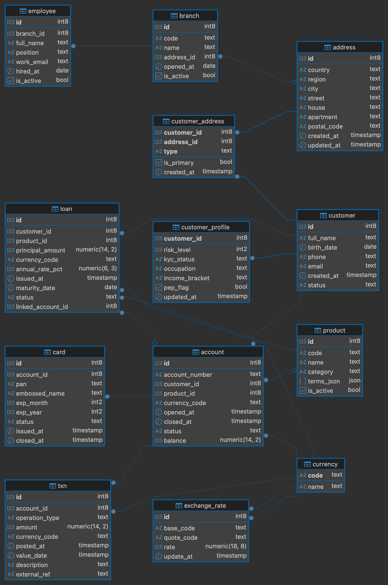

# Отчёт по Лабораторной работе №1: Проектирование БД

* **Тема**: Банк (https://www.sberbank.ru)
* **Схема БД**: lab01
* **СУБД**: PostgreSQL 16

## 1. Описание предметной области и ключевых процессов
### Цель
Спроектировать реляционную БД для базовых операций розничного банка

### Основные сущности:
* **Клиент**: персональные данные и KYC-профиль
* **Адреса**: несколько адресов на клиента (прописка/рабочий)
* **Отделение/сотрудники**
* **Валюты и котировки**: мультивалютность
* **Счета**: валюта, статус, баланс
* **Карты**: дебетовые, привязаны к счёту
* **Транзакции**: движения по счетам
* **Продукты**: типы счетов/кредитов/карт
* **Кредиты**

### Ключевые процессы:
* **Онбординг клиента**: создание customer, заполнение customer_profile, привязка address через customer_address
* **Открытие счёта**: запись в account (валюта, продукт), выпуск card
* **Платёж/перевод**: вставка в txn
* **Обслуживание карт**: закрытие, срок действия
* **Кредитование**: создание
* **Курсы валют**: последние котировки для расчетов

## 2. SQL-код создания БД
```sql
create schema if not exists lab01;
set search_path to lab01, public;

create table if not exists customer (
                                        id          bigint      primary key,
                                        full_name   text        not null,
                                        birth_date  date        null,
                                        phone       text        not null unique,
                                        email       text        not null unique,
                                        created_at  timestamp   not null default now(),
    status      text        not null default 'active'
    );

create table if not exists customer_profile (
                                                customer_id     bigint       primary key,
                                                risk_level      smallint     null check (risk_level is null or (risk_level between 0 and 5)),
    kyc_status      text         null,
    occupation      text         null,
    income_bracket  text         null,
    pep_flag        boolean      not null default false,
    updated_at      timestamp  not null default now()
    );

create table if not exists address (
                                       id           bigint primary key,
                                       country      text        not null,
                                       region       text        null,
                                       city         text        not null,
                                       street       text        null,
                                       house        text        null,
                                       apartment    text        null,
                                       postal_code  text        null,
                                       created_at   timestamp not null default now(),
    updated_at   timestamp not null default now()
    );

create table if not exists customer_address (
                                                customer_id bigint  not null,
                                                address_id  bigint  not null,
                                                type        text    not null,
                                                is_primary  boolean not null default false,
                                                created_at  timestamp not null default now(),
    primary key (customer_id, address_id, type)
    );

create table if not exists branch (
                                      id          bigint       primary key,
                                      code        text         not null unique,
                                      name        text         not null,
                                      address_id  bigint       null,
                                      opened_at   date         null,
                                      is_active   boolean      not null default true
);

create table if not exists employee (
                                        id          bigint   primary key,
                                        branch_id   bigint      not null,
                                        full_name   text        not null,
                                        position    text        null,
                                        work_email  text        not null unique,
                                        hired_at    date        null,
                                        is_active   boolean     not null default true
);


create table if not exists currency (
                                        code    text    primary key,
                                        name    text    not null
);


create table if not exists exchange_rate (
                                             id          bigint   primary key,
                                             base_code   text        not null unique,
                                             quote_code  text        not null unique,
                                             rate        numeric(18, 8) not null check (rate > 0),
    update_at   timestamp  not null default now()
    );


create table if not exists product (
                                       id         bigint      primary key,
                                       code       text        not null unique,
                                       name       text        not null,
                                       category   text        not null,
                                       terms_json json        null,
                                       is_active  boolean     not null default true
);


create table if not exists account (
                                       id              bigint          primary key,
                                       account_number  text            not null unique,
                                       customer_id     bigint          not null,
                                       product_id      bigint          null,
                                       currency_code   text            not null,
                                       opened_at       timestamp       not null default now(),
    closed_at       timestamp       null,
    status          text            not null default 'active',
    balance         numeric(14,2)   null
    );


create table if not exists card (
                                    id            bigint    primary key,
                                    account_id    bigint       not null,
                                    pan           text         not null,
                                    embossed_name text         null,
                                    exp_month     smallint     not null check (exp_month between 1 and 12),
    exp_year      smallint     not null,
    status        text         not null default 'active',
    issued_at     timestamp  not null default now(),
    closed_at     timestamp  null
    );


create table if not exists txn (
                                   id              bigint     primary key,
                                   account_id      bigint        not null,
                                   operation_type  text          not null,
                                   amount          numeric(14,2) not null,
    currency_code   text          not null,
    posted_at       timestamp   not null default now(),
    value_date      timestamp   null,
    description     text          null,
    external_ref    text          null
    );


create table if not exists loan (
                                    id               bigint     primary key,
                                    customer_id      bigint        not null,
                                    product_id       bigint        not null,
                                    principal_amount numeric(14,2) not null check (principal_amount >= 0),
    currency_code    text          not null,
    annual_rate_pct  numeric(6,3)  not null check (annual_rate_pct >= 0),
    issued_at        timestamp   not null default now(),
    maturity_date    date          not null,
    status           text          not null default 'active',
    linked_account_id bigint       null
    );

alter table customer_profile
    add foreign key (customer_id) references customer(id) on delete cascade;

alter table customer_address
    add foreign key (customer_id) references customer(id) on delete cascade,
    add foreign key (address_id) references address(id) on delete cascade;

alter table branch
    add foreign key (address_id) references  address(id);

alter table employee
    add foreign key (branch_id) references branch(id) on delete restrict;


alter table exchange_rate
    add foreign key (base_code)  references currency(code) on delete restrict,
    add foreign key (quote_code) references currency(code) on delete restrict;


alter table account
    add foreign key (customer_id) references customer(id) on delete restrict,
    add foreign key (product_id) references product(id) on delete restrict,
    add foreign key (currency_code) references currency(code) on delete restrict;

alter table card
    add foreign key (account_id) references account(id) on delete cascade;

alter table txn
    add foreign key (account_id) references account(id) on delete cascade,
    add foreign key (currency_code) references currency(code) on delete restrict;

alter table loan
    add foreign key (customer_id) references customer(id) on delete restrict,
    add foreign key (product_id)  references product(id)  on delete restrict,
    add foreign key (currency_code) references currency(code) on delete restrict,
    add foreign key (linked_account_id) references account(id) on delete set null;
```

## 3. ERD-диаграмма

[ER-диаграмму (GraphML)](assets/lab01_erd.graphml)