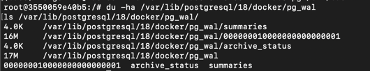
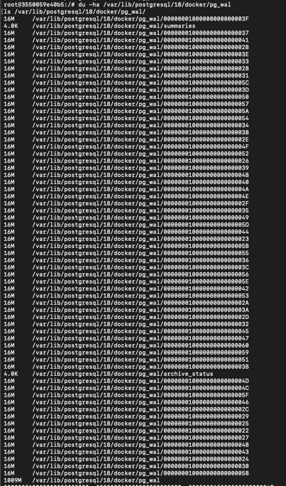
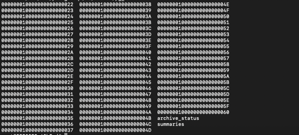
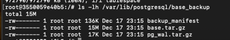
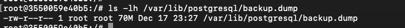

# Отчёт по Лабораторной работе №4: Функции и триггеры

* **СУБД**: PostgreSQL 16

## 1. WAL
### Параметры WAL
1. wal_level — детальность WAL. Влияет на возможность репликации/логической репликации:
   - minimal - ограничено
   - replica - обычно по умолчанию
   - logical - нужно для логической репликации
2. synchronous_commit — когда транзакция считается завершённой: ждать ли гарантированной записи WAL на диск
   - on - безопаснее, но медленнее
   - off - быстрее, но при аварии возможна потеря последних коммитов
3. max_wal_size / min_wal_size — диапазон, в котором Postgres старается удерживать объём WAL до переработки/удаления сегментов
   - Больший max_wal_size - реже чекпоинты, больше WAL на диске
   - min_wal_size - минимальный запас WAL, чтобы не пересоздавать слишком часто
4. wal_compression — сжатие образов страниц в WAL (уменьшает объём WAL ценой CPU)
5. checkpoint_timeout — максимальный интервал между автоматическими чекпоинтами
6. checkpoint_completion_target — как растянуть запись данных чекпоинта во времени:
   - Чем ближе к 1.0 — тем ровнее запись
7. archive_mode — включает архивацию WAL
8. archive_command — копирует готовый WAL-сегмент в архив (если архивация включена):
   - disabled — архивации по факту нет

### Наблюдение за WAL
#### Состояние до нагрзуки
lsn = 0/17AF240 
wal_filename = 000000010000000000000001
общий размер каталока pg_wal:

#### Состояние после нагрузки
lsn = 0/282BF798
wal_filename = 000000010000000000000028
общий размер каталока pg_wal:

#### Вывод
**Что произошло:** 
1. LSN сильно вырос -  любая массовая вставка/обновление двигает LSN вперёд, потому что Postgres сначала пишет изменения в WAL, и только потом асинхронно дожимает их в data-файлы
2. Сменился текущий WAL-сегмент и резко вырос каталог pg_wal - в процессе вставки данных Postgres переключился на более поздние WAL-сегменты. По выводу du/ls видно много файлов по 16MB, так как это стандартный размер одного WAL-сегмента, и при большой записи Postgres создаёт/использует много таких сегментов
**Почему произошло:**
WAL-сегменты не удаляются мгновенно, они либо переиспользуются, либо удерживаются до условий:
- пока не произошёл checkpoint, старые сегменты могут быть ещё нужны для восстановления
- лимитами max_wal_size/min_wal_size (Postgres держит WAL в определённом диапазоне)
- возможной репликацией/слотами/архивацией (если включены — WAL может удерживаться дольше)

## 2. Чекпоинты
### Наблюдение за статистикой чекпоинтов
#### Состояние до чекпоинта
lsn = 0/282BF798
wal_filename = 000000010000000000000028

#### Состояние после чекпоинта
lsn = 0/6B2349C0
wal_filename = 00000001000000000000006B

#### Вывод
**Что изминилось:** 
1.	LSN продвинулся вперёд, а текущий WAL-сегмент сменился с ...0028 на ...006B
2.	Это означает, что за время между замерами было записано много WAL, и Postgres перешёл на следующие WAL-сегменты
## 3. Бэкапы и восстановление
### pg_basebackup

#### За что отвечают файлы:
1. base.tar.gz - основная часть физического бэкапа кластера: файлы данных PostgreSQL (таблицы, индексы, системные каталоги) в виде архива
2. pg_wal.tar.gz - WAL-сегменты, нужные для консистентности бэкапа
3. backup_manifest - Манифест бэкапа: служебный файл со списком/метаданными содержимого бэкапа. Используется для проверки целостности бэкапа и корректности восстановления

#### Что означает ключ -X stream
-X stream означает, что WAL для бэкапа будет получаться потоково во время выполнения pg_basebackup, а не отдельными шагами 
Это повышает шанс получить консистентный физический бэкап, потому что нужные WAL-сегменты подтягиваются сразу

#### Чем -Ft отличается от -Fp
1. -Ft:
   - Результат: архивы
   - Плюсы: удобно переносить/хранить файлами, можно сжимать (-z)
   - Минусы: для восстановления нужно распаковывать архивы
2. -Fp:
   - Результат: каталог с теми же файлами, что и в PGDATA
   - Плюсы: восстановление часто проще, не надо распаковывать tar
   - Минусы: не поддерживается сжатие

### pg_dump

#### Разница между pg_basebackup и pg_dump
1. Физический (pg_basebackup) копирует файлы кластера (низкоуровневое состояние):
   - Плюсы: быстро на больших БД, подходит для PITR вместе с архивом WAL, восстанавливает как было
   - Минусы: привязан к версии/архитектуре/формату кластера, восстановление весь кластер, а не выборочно
2. Логический (pg_dump) сохраняет логическое представление (схемы/таблицы/данные):
   - Плюсы: можно восстановить в другую версию Postgres, выборочно по объектам, удобно мигрировать
   - Минусы: на больших объёмах медленнее, восстановление дольше, не покрывает всё физического состояния

### Восстановление логического бэкапа
#### Состояние с добавленными данными после pg_dump
rows_count = 1200000

#### Состояние на pg_dump
rows_count = 700000

#### Изменения
1. После выполнения pg_dump в таблицу test были добавлены дополнительные данные
2. После восстановления дампа в новую базу данных postgres_restored таблица test содержит состояние на момент создания бэкапа, без последующих изменений

## Восстановление из физического бэкапа
Физический бэкап — это копия PGDATA. Aлгоритм восстановления:
1.	Остановить сервер PostgreSQL, чтобы файлы не менялись во время восстановления
2.	Подготовить пустой каталог данных или новый инстанс
3.	Скопировать/распаковать файлы бэкапа в PGDATA
4.	(Если используется PITR) подготовить WAL-архив и создать recovery.signal + настроить параметры восстановления (restore_command, recovery_target_time/lsn, и так далее)
5.	Запустить сервер, дождаться завершения восстановления
6.	Проверить целостность и доступность данных

В Docker-практике:
- либо поднять новый контейнер с отдельным volume под PGDATA и положить туда содержимое base_backup
- либо остановаить текущий контейнер, очистить data volume и расклаложить туда бэкап